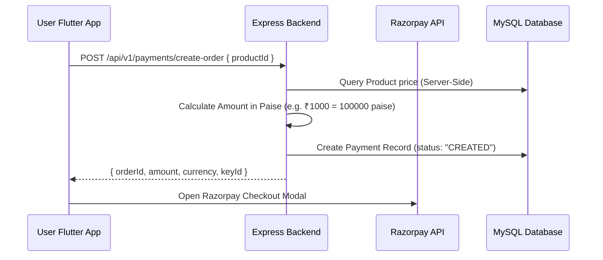

# Vridhi Payment Architecture Specification

## 1. Overview
The Payment Subsystem integrates **Razorpay Payment Gateway** with server-side amount calculation and HMAC-SHA256 signature verification.

## 2. Order Creation Flow

## 3. Signature Verification & Status Matrix
- **`CREATED`**: Order generated server-side.
- **`PENDING`**: Payment initiated by user.
- **`SUCCESS`**: Signature verified via `crypto.createHmac('sha256', RAZORPAY_KEY_SECRET).update(orderId + '|' + paymentId).digest('hex')`. Creates `UserProductAccess` in `PENDING_APPROVAL` status.
- **`VERIFICATION_FAILED`**: Signature mismatch or tampered payload.
- **`REFUNDED`**: Payout processed by Admin.

## 4. Environment Variables
- `RAZORPAY_KEY_ID`: Client key ID.
- `RAZORPAY_KEY_SECRET`: Server secret key for HMAC signature verification.
