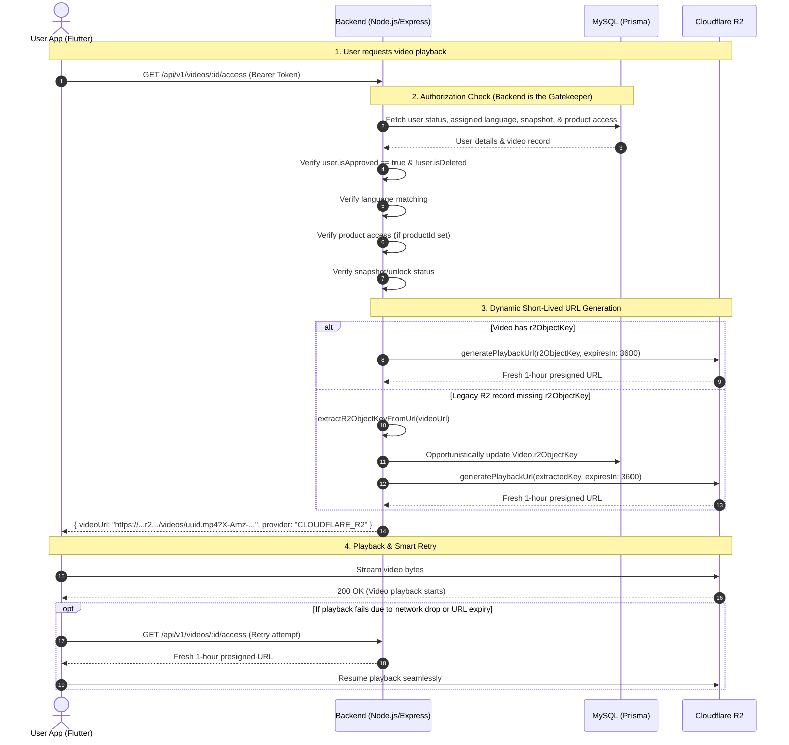

# VRIDHI — R2 Lifetime Playback Architecture Documentation

## 1. Executive Summary

This document describes the corrected Cloudflare R2 video storage, authorization, presigned URL generation, and playback architecture implemented in the VRIDHI platform.

Previously, R2 video uploads generated a 7-day presigned URL at upload time and stored that presigned URL permanently in `Video.videoUrl`. Consequently, after 7 days, video playback failed with HTTP 403 Forbidden errors because the stored URL expired and the application re-used the stale URL without re-signing.

The corrected architecture separates **permanent object identity** from **temporary access credentials**:
1. **Permanent Object Identity**: The R2 object key (e.g. `videos/<uuid>.mp4`) is stored permanently in the database (`Video.r2ObjectKey`).
2. **Dynamic Short-Lived Credentials**: Every authorized playback request (`GET /api/v1/videos/:id/access`) triggers the backend to verify user authorization and generate a **fresh short-lived presigned URL** (1-hour TTL).
3. **Lifetime Playback**: Authorized users enjoy lifetime access to video content without any 7-day expiration limit.

---

## 2. Architecture Comparison

| Aspect | Legacy Architecture (Broken) | Fixed Architecture (Lifetime) |
| :--- | :--- | :--- |
| **Database Storage** | Expiring presigned URL stored in `Video.videoUrl` | Permanent object key stored in `Video.r2ObjectKey` |
| **URL Presigning** | Occurred once during video upload | Occurs on demand per playback request (`/access`) |
| **URL Expiration** | Hardcoded 7-day TTL | Short 1-hour TTL, dynamically generated |
| **User Library Response** | Returned stored (possibly expired) presigned URL | Returns `videoUrl: null` for R2 videos, forcing `/access` call |
| **Player Behavior** | Initialized controller directly with `widget.video.videoUrl` | Calls `GET /videos/:id/access` to get fresh URL before player init |
| **Retry Behavior** | Retried the same expired URL | Requests a fresh URL via `/access` on retry |
| **Cloud Deletion** | Passed full presigned URL to R2 delete API | Uses permanent `r2ObjectKey` for R2 object deletion |

---

## 3. Detailed Authorization & Playback Flow



---

## 4. Key Implementation Details

### 4.1 Database Schema (`prisma/schema.prisma`)
Added `r2ObjectKey` field to `Video` model:
```prisma
model Video {
  id           String  @id @default(uuid())
  title        String
  description  String? @db.Text
  videoUrl     String  @db.VarChar(512)
  thumbnailUrl String? @db.VarChar(512)
  r2ObjectKey  String? @db.VarChar(512) // Permanent R2 key, e.g. videos/<uuid>.mp4
  provider     String  @default("CLOUDINARY")
  ...
}
```

### 4.2 Safe Object Key Extraction (`cloudflareR2.service.js`)
```javascript
extractR2ObjectKeyFromUrl(url)
```
- Extracts `videos/<uuid>.mp4` from path-style R2 endpoints (`.r2.cloudflarestorage.com`), custom `.r2.dev` domains, and presigned URLs with query parameters.
- Safely returns `null` for Cloudinary, YouTube, or invalid URLs.

### 4.3 Migration Script (`scripts/migrateR2ObjectKeys.js`)
- One-time migration script scanned existing `Video` records.
- Populated `r2ObjectKey` for R2 videos while leaving Cloudinary records untouched.
- Self-healing fallback: If an unmigrated R2 video is accessed via `/access`, the backend automatically extracts and persists its `r2ObjectKey` on the fly.

### 4.4 Flutter Mobile Player (`video_player_screen.dart`)
- **Initialization**: Before player initialization, the screen calls `/videos/:id/access` to get a fresh URL.
- **Smart Retry**: On error, the "Retry Connection" button requests a NEW presigned URL via `/access` (up to 3 attempts), ensuring expired credentials never block recovery.
- **Cloudinary Compatibility**: Non-R2 videos (Cloudinary, Cloudflare Stream) continue to function without disruption.

---

## 5. Security & Egress Verification

- **Private Bucket Integrity**: Cloudflare R2 bucket permissions remain strictly **PRIVATE**.
- **Server-Side Gatekeeping**: Presigned URLs are generated ONLY after user authorization checks pass.
- **Short Credential Window**: Presigned URLs carry a 1-hour TTL. Even if a URL is leaked, it expires within 60 minutes, while authorized users can refresh it seamlessly indefinitely.
