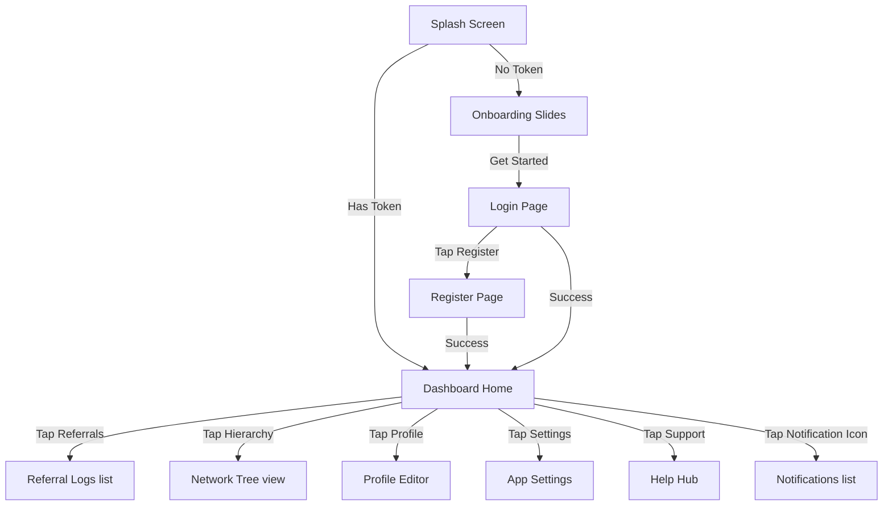
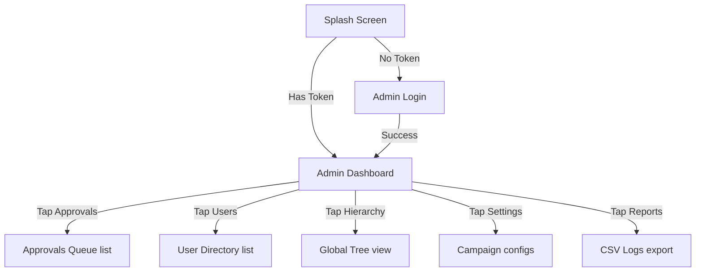

# User Interface Flow

## 1. User Application Flow

```mermaid
graph TD
    Splash[Splash Screen] -->|No Token| Onboarding[Onboarding Slides]
    Splash -->|Has Token| Dashboard[Dashboard Home]
    Onboarding -->|Get Started| Login[Login Page]
    Login -->|Tap Register| Register[Register Page]
    Register -->|Success| Dashboard
    Login -->|Success| Dashboard
    
    Dashboard -->|Tap Referrals| RefLogs[Referral Logs list]
    Dashboard -->|Tap Hierarchy| Tree[Network Tree view]
    Dashboard -->|Tap Profile| Profile[Profile Editor]
    Dashboard -->|Tap Settings| Settings[App Settings]
    Dashboard -->|Tap Support| Support[Help Hub]
    Dashboard -->|Tap Notification Icon| Alerts[Notifications list]
```

## 2. Admin Application Flow

```mermaid
graph TD
    Splash[Splash Screen] -->|No Token| Login[Admin Login]
    Splash -->|Has Token| Dashboard[Admin Dashboard]
    Login -->|Success| Dashboard
    
    Dashboard -->|Tap Approvals| Approvals[Approvals Queue list]
    Dashboard -->|Tap Users| Directory[User Directory list]
    Dashboard -->|Tap Hierarchy| GlobalTree[Global Tree view]
    Dashboard -->|Tap Settings| CampaignSettings[Campaign configs]
    Dashboard -->|Tap Reports| Reports[CSV Logs export]
```
