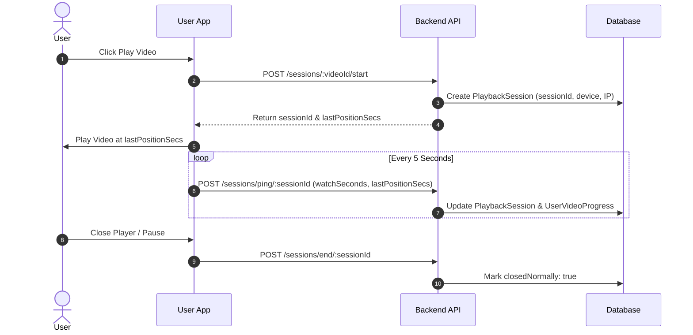
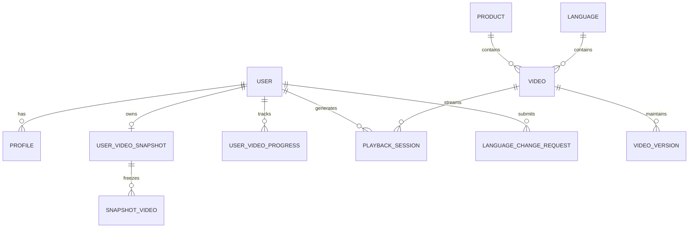
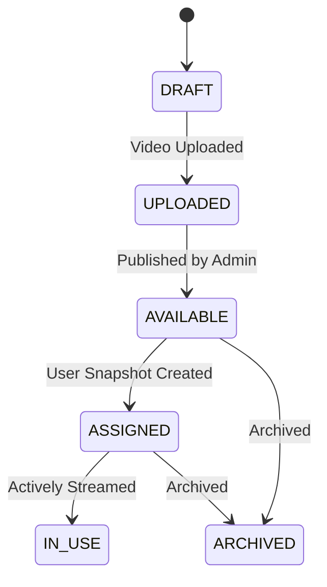
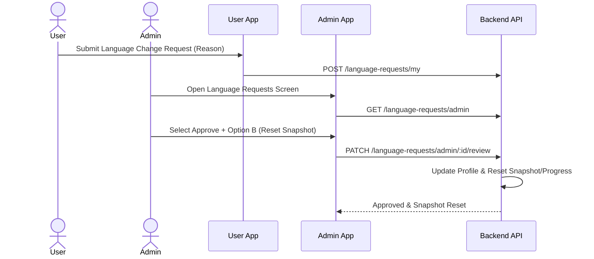

# Video Learning Platform - Enterprise Architecture Specification

> **Document Version**: 2.0.0 (Final Production Hardening Release)  
> **Status**: Production Ready  
> **Platform**: Equity Plus Video Learning Network  

---

## Table of Contents
1. [Functional Requirements](#1-functional-requirements)
2. [Business Rules](#2-business-rules)
3. [Snapshot Architecture](#3-snapshot-architecture)
4. [Refund Engine](#4-refund-engine)
5. [Product Architecture](#5-product-architecture)
6. [Language Architecture](#6-language-architecture)
7. [Playback Flow](#7-playback-flow)
8. [Playback Session Flow](#8-playback-session-flow)
9. [Upload Pipeline](#9-upload-pipeline)
10. [Cloudinary Flow](#10-cloudinary-flow)
11. [Database ER Diagram](#11-database-er-diagram)
12. [API Architecture](#12-api-architecture)
13. [Security Architecture](#13-security-architecture)
14. [State Diagrams](#14-state-diagrams)
15. [Sequence Diagrams](#15-sequence-diagrams)
16. [Admin Workflow](#16-admin-workflow)
17. [User Workflow](#17-user-workflow)
18. [Video Unlock Logic](#18-video-unlock-logic)
19. [Refund Logic](#19-refund-logic)
20. [Versioning Strategy](#20-versioning-strategy)
21. [Future Scalability](#21-future-scalability)
22. [Performance Strategy](#22-performance-strategy)
23. [Deployment Strategy](#23-deployment-strategy)
24. [Testing Strategy](#24-testing-strategy)
25. [Recovery Strategy](#25-recovery-strategy)

---

## 1. Functional Requirements
- **Multilingual Video Hub**: System supports dynamic language folders (English, Hindi, Tamil, Bengali, etc.).
- **Product Layer**: Course content is grouped under hierarchical Product packages (`Product` -> `Language` -> `Video`).
- **Snapshot Immutability**: Video refund policy depends strictly on the snapshot taken when the user FIRST enters the Video Learning Hub after account approval.
- **Seek Protection**: Forward seek jumps are ignored; playback time is calculated using real elapsed playback heartbeats.
- **Playback Sessions**: Every playback instance creates a unique `PlaybackSession` with device, OS, IP, pause, seek, and background counters.
- **Video Versioning**: Each video retains immutable version history ($V1 \rightarrow V2 \rightarrow V3$).
- **Targeted Announcements**: Admin can broadcast notifications targeting `ALL`, `PRODUCT`, `LANGUAGE`, or specific `USER`.

---

## 2. Business Rules
- **Rule 1 (Immutable Snapshot)**: Future videos uploaded by admin MUST NOT affect a user's snapshot count or refund eligibility calculation.
- **Rule 2 (Refund Ineligibility)**: Watching 25% or more of the snapshot's total duration OR reaching 30 days post-approval permanently voids refund eligibility.
- **Rule 3 (Assigned Video Deletion Protection)**: Videos assigned to any paid user's snapshot (`SnapshotVideo`) CANNOT be deleted by admins.
- **Rule 4 (Permanent Registration Language)**: Post-approval, users cannot directly edit their language without submitting a formal `LanguageChangeRequest`.

---

## 3. Snapshot Architecture
When an approved user opens the Video Hub for the first time:
1. System queries all active videos matching the user's assigned `languageId` and `productId`.
2. Creates a parent `UserVideoSnapshot` row capturing:
   - `snapshotVideoCount`: Number of available videos.
   - `snapshotTotalDurationSeconds`: Sum of video durations.
   - `refundEligible`: `true`.
3. Creates child `SnapshotVideo` rows for each video, freezing the `videoId` and `videoDurationSeconds`.

---

## 4. Refund Engine

$$\text{WatchedPercentage} = \left( \frac{\sum \text{EffectiveWatchedSecs}}{\text{SnapshotTotalDurationSeconds}} \right) \times 100$$

$$\text{RefundEligible} = \begin{cases} 
\text{false} & \text{if } \text{WatchedPercentage} \ge 25.0\% \text{ or } \text{DaysJoined} \ge 30 \\ 
\text{true} & \text{otherwise} 
\end{cases}$$

---

## 5. Product Architecture
- Top-level entity: `Product` (`id`, `name`, `code`, `status`).
- Profile mapping: `Profile.assignedProductId`.
- Video mapping: `Video.productId`.

---

## 6. Language Architecture
- Entity: `Language` (`id`, `name`, `code`, `isDefault`).
- Profile mapping: `Profile.assignedLanguageId`.
- Language Requests: `LanguageChangeRequest` with Option A (keep snapshot) and Option B (purge & snapshot reset).

---

## 7. Playback Flow
1. User requests video access: `GET /api/v1/videos/:id/access`.
2. Backend validates authentication, approval, disclaimer acceptance, language match, product match, and snapshot access.
3. System returns authorized playback credentials.

---

## 8. Playback Session Flow

---

## 9. Upload Pipeline
Stage Sequence:
1. `Uploading` (15%)
2. `Cloudinary Upload` (40%)
3. `Generate Thumbnail` (60%)
4. `Generate Metadata` (75%)
5. `Verify Duration` (90%)
6. `Virus Scan Hook` (98%)
7. `Ready` (100%)

---

## 10. Cloudinary Flow
- Media files are uploaded to Cloudinary storage.
- Backend stores Cloudinary public URLs in `Video.videoUrl` and `Video.thumbnailUrl`.
- Direct permanent URLs are wrapped in secure backend authorized stream tokens.

---

## 11. Database ER Diagram

---

## 12. API Architecture
Restful endpoints organized under `/api/v1/`:
- `/auth`: Registration with mandatory language.
- `/videos`: User video hub, secure access, heartbeat, search.
- `/sessions`: Playback session start, ping, end, resume.
- `/versions`: Video version creation, history, restore.
- `/products`: Product layer CRUD.
- `/language-requests`: User language requests & admin review.
- `/announcements`: Targeted broadcasts.
- `/analytics`: Admin video & global engagement metrics.

---

## 13. Security Architecture
- JWT Bearer token authentication.
- Role-based authorization (`USER`, `ADMIN`).
- Deletion protection on assigned videos (`SnapshotVideo` verification).
- Seek protection eliminating fake progress manipulation.

---

## 14. State Diagrams

### Video Lifecycle State Machine

---

## 15. Sequence Diagrams

### Language Change Request & Admin Review

---

## 16. Admin Workflow
1. Create Languages & Products.
2. Run Upload Pipeline to publish Videos under Product & Language.
3. Review Language Change Requests (Option A vs Option B).
4. Monitor Video Analytics, Viewers, & Platform Audit Logs.

---

## 17. User Workflow
1. Select Preferred Language during Registration.
2. Login and open Video Learning Hub (first entry creates immutable snapshot).
3. Watch videos with seamless cross-device resume and seek-protected progress tracking.
4. Request language change if needed.

---

## 18. Video Unlock Logic
- Unlocked Videos: All videos present in the initial snapshot + all future videos if 25% watched or 30 days completed.
- Locked Videos: Future uploaded videos before 25% or 30 day threshold are displayed as blurred cards with lock notices.

---

## 19. Refund Logic
- **Refund Active**: Watched % < 25.0% AND Days Joined < 30.
- **Refund Void**: Watched % $\ge$ 25.0% OR Days Joined $\ge$ 30.

---

## 20. Versioning Strategy
- Videos retain version history records (`VideoVersion`).
- Version updates do NOT alter existing snapshots.
- Admins can restore previous versions at any time.

---

## 21. Future Scalability
- Redis caching for global video lists.
- CDN signed URL integration for Cloudinary streams.
- Horizontal database scaling via TiDB Cloud.

---

## 22. Performance Strategy
- Indexed database queries on `userId`, `videoId`, `languageId`, `productId`, `status`.
- Throttled 5-second playback session pings.

---

## 23. Deployment Strategy
- Database schema sync using `npx prisma db push`.
- Dockerized NodeJS backend deployment.
- Flutter Web / APK distribution for Admin & User apps.

---

## 24. Testing Strategy
- Automated backend syntax verification (`npm run lint`).
- Flutter static code analysis (`flutter analyze --no-fatal-infos`).

---

## 25. Recovery Strategy
- Transactional rollback on language change & snapshot reset failures.
- Backup audit log records for all administrative events.
